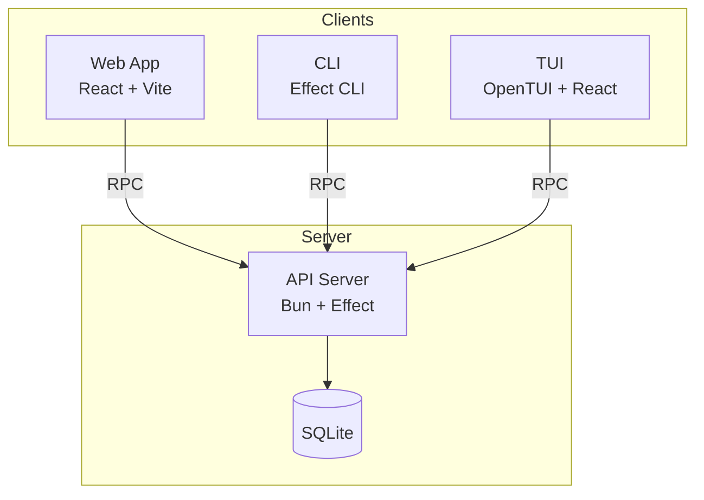

# SubQ

Health tracking application for subcutaneous injection management.

## Architecture

SubQ uses a client/server architecture with multiple clients sharing a single API server:



All clients communicate with the server using type-safe RPC (Effect RPC). The shared package (`@subq/shared`) defines domain types and RPC contracts used by both clients and server.

| Package | Description |
|---------|-------------|
| `packages/api` | API server with RPC handlers, database, auth |
| `packages/web` | Web client (React, Vite) |
| `packages/cli` | Command-line client |
| `packages/tui` | Terminal UI client (React, OpenTUI) |
| `packages/shared` | Shared types, RPC definitions |

## CLI

A command-line interface is available for managing injections, weight logs, and schedules.

### Installation

Download the latest binary for your platform from [Releases](https://github.com/MichaelVessia/subq/releases/tag/cli-latest):

```bash
# macOS Apple Silicon
curl -L https://github.com/MichaelVessia/subq/releases/download/cli-latest/subq-darwin-arm64 -o subq
chmod +x subq
sudo mv subq /usr/local/bin/

# macOS Intel
curl -L https://github.com/MichaelVessia/subq/releases/download/cli-latest/subq-darwin-x64 -o subq
chmod +x subq
sudo mv subq /usr/local/bin/

# Linux x64
curl -L https://github.com/MichaelVessia/subq/releases/download/cli-latest/subq-linux-x64 -o subq
chmod +x subq
sudo mv subq /usr/local/bin/

# Linux ARM64
curl -L https://github.com/MichaelVessia/subq/releases/download/cli-latest/subq-linux-arm64 -o subq
chmod +x subq
sudo mv subq /usr/local/bin/
```

### Usage

```bash
# Login first
subq auth login

# See all commands
subq --help
```

The CLI supports JSON output (`--json`) for easy integration with scripts and AI agents.

## Email Reminders

Users receive email reminders on shot days (when an injection is due). Reminders are sent daily at 12:00 UTC via a GitHub Actions workflow that calls the API.

- **Opt-out**: Users can disable reminders in Settings → Notifications
- **Email provider**: [Resend](https://resend.com)

### Setup (Self-hosting)

1. Create a [Resend](https://resend.com) account and verify your domain
2. Generate a random secret: `openssl rand -hex 32`
3. Add secrets to Fly.io:
   ```bash
   fly secrets set RESEND_API_KEY=re_your_api_key
   fly secrets set REMINDER_SECRET=<generated_secret>
   ```
4. Add `REMINDER_SECRET` to GitHub repo secrets (Settings → Secrets → Actions)

### Testing

Manually trigger the workflow from GitHub Actions → "Send Reminders" → "Run workflow". Manual triggers use `force=true` to send to all users with active schedules, regardless of due date.

## Links

- **Production**: https://subq.vessia.net
- **Fly Dashboard**: https://fly.io/apps/subq

## Development

```bash
# Install dependencies
bun install

# Start local dev server (API + Web + Jaeger)
bun run dev

# Jaeger UI: http://localhost:16686

# Run tests
bun run test

# Run e2e tests
bun run test:e2e
```

## Deployment

Deploys automatically on push to `master` via GitHub Actions.

```bash
# Manual deploy
fly deploy

# Set secrets (first time)
fly secrets set BETTER_AUTH_SECRET="your-secret-here"

# Create volume (first time)
fly volumes create subq_data --region ewr --size 1
```

## Local Production Testing

```bash
# Build and run full stack locally with Docker
docker compose up --build

# App: http://localhost:8080
# Jaeger: http://localhost:16686
```
